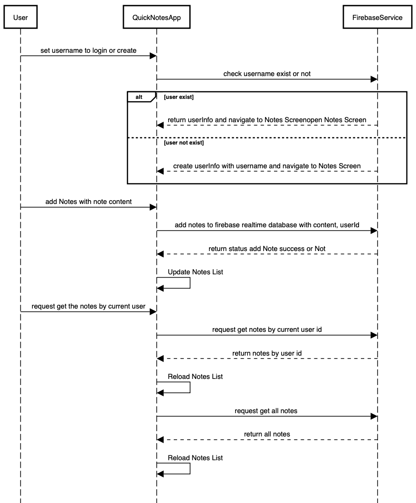

# QuickNotesDemo
## 1 Requirments
- Xcode 15.3
- iOS 17.4
## 2. Approach
- The note application The Notes application is a simple iOS app built using SwiftUI and Firebase
- User Interface (UI): Designed interface with SwiftUI, including screens for displaying notes, adding new notes, and set username.
- Firebase integration: Using Firebase realtime database to create/add user and notes.
- Functionality:
    
    - Set username:
    - Get the Notes of Current Users
    - Get the Notes of Other Users
    - Update Realtime Notes
- I spent 2 days to create the application according to Assignment Breif
## 3. Diagram

## 4. Limitations
- Currently, just get all notes (no screens to show notes for each users).
- No edit and delete notes